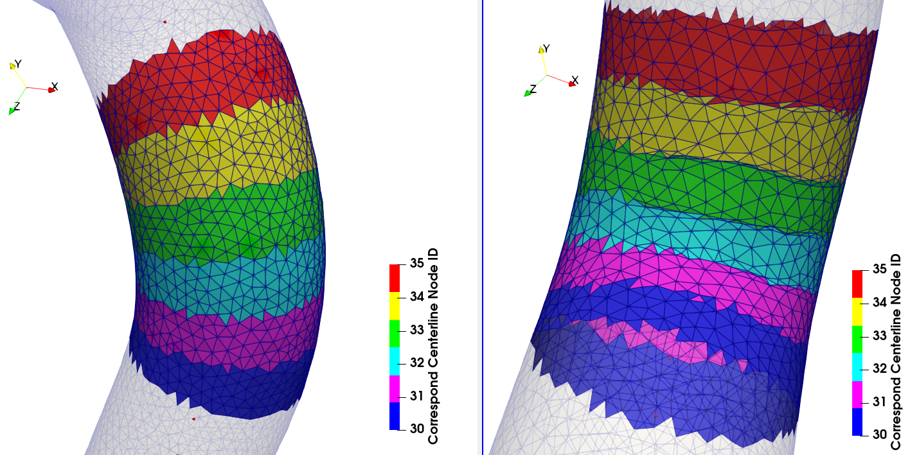

# 中心線点群数
メッシュ変形の可否や変形後メッシュの品質は、中心線点群数に強く依存する。表面三角形パッチの粗さや、基準・目標中心線の曲率に応じて適切に設定する必要がある。

## 点群数が少ないことが問題になる例

   
  <em>Fig.1: 表面三角形パッチと中心線の対応関係。左は基準モデルBH0005R、右は変形後モデルBH0017R</em>

RESOLUTION_FACTOR : 0.15, 中心線点群数160で変形させると、エラーが出て変形が失敗する(画像右の位置でメッシュが交差する)。 
基準時に屈曲外側にあった三角形パッチが、変形後に屈曲内側になり、中心線対応の境界で三角形がつぶれている(画像右)。 
これは表面三角形に対して中心線点群数が少ないために起きると考えられる。その理由として
+ 中心線点群数を320に増やすと変形に成功する
+ この組み合わせ(基準:BH0005R 目標:BH0017R)は、RESOLUTION_FACTOR : 0.25 (比較的粗いメッシュ) で基準メッシュ生成・変形したときは、点群数160でもエラーが出ない

基準   : D:\olab\thesis\simulation-result\u-driver-160-oriBH0005R-Re400\Resolution_factor_015_num_of_cl_160\alignment-off\runs\m-BH0005_R (alignment-on\runs\m-BH0005_R)  
変形後 : D:\olab\thesis\simulation-result\u-driver-160-oriBH0005R-Re400\Resolution_factor_015_num_of_cl_160\alignment-off\runs\d-BH0017_R

## 点群数が多いことが問題になる例

