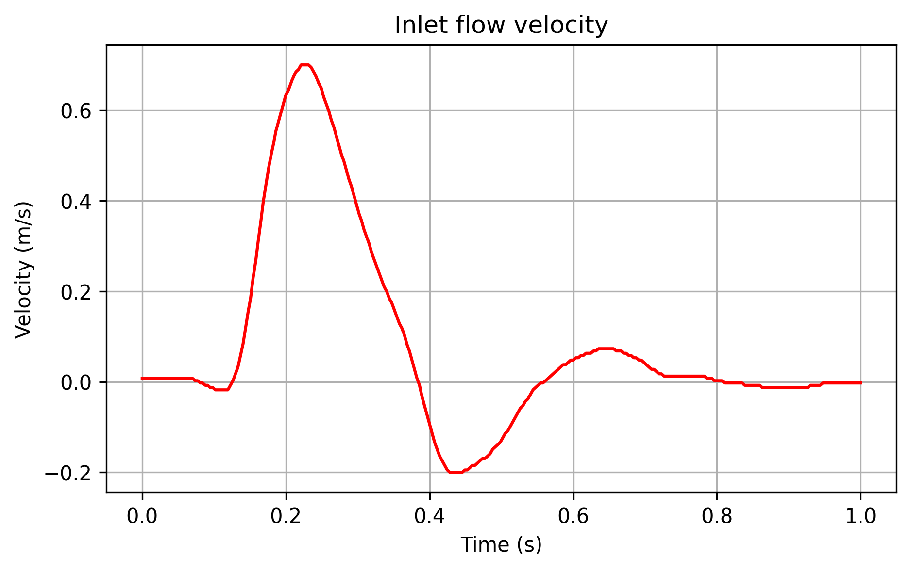

# pimpleFoam 
+ 非圧縮・粘性流体の非定常流れを解くためのソルバ
+ 圧力-速度連成手法にPIMPLEアルゴリズム(PISO法+SIMPLE法)を用いる

# 拍動流
pimpleFoamソルバで拍動流の計算を行う。つまり下図のような周期的な流入流速を境界条件に設定する。
+ 流速波形は数値データに変換して constant/ に置く。
+ 0/U ファイル内で、 流入断面(INLET)が真円に近いという前提で、平均半径や中心座標をメッシュファイルから求め、平均流速が下図のように時間変化するような放物線分布を計算し、流入流速とする。
+ system/controlDict で、何周期分計算するか(= endTime)(※流路全体が周期定常に達してから最後の1周期を評価すべき)や出力刻み(writeInterval)も含め、適切に設定する。

  

## 参考
流入条件とした流速波形の実測値 : 

Xuanyu Li., et al., 2019, Tortuosity of the superficial femoral artery and its influence on blood flow patterns and risk of atherosclerosis.
